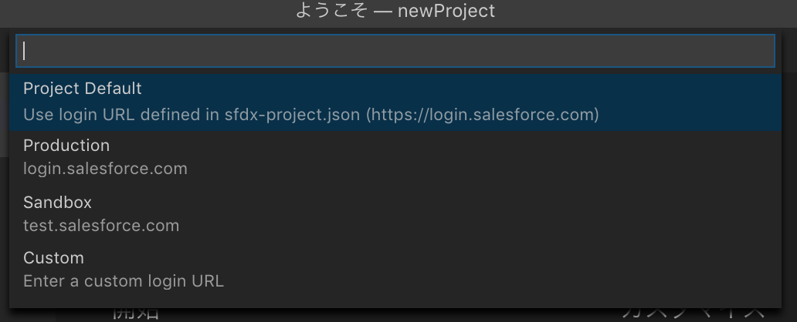

# なぜVSCode使うのか？  
- eclipseおせぇ
- eclipse使いにくい
- eclipse自動補完機能がないことに等しい
- __VSCodeのextensionが多い__  
- etc...    

# 1)事前準備

1. [Salesforce CLI](https://developer.salesforce.com/docs/atlas.ja-jp.sfdx_setup.meta/sfdx_setup/sfdx_setup_install_cli.htm)  
## Salesforce CLIをインストール  
```bash
sfdx plugins --core 
// インストールされているかどうかの確認   
```
```bash
sfdx --help 
// こちらのコマンドを使うと、
// 常にターミナルにてコマンドの使い方を確認できる
// https://developer.salesforce.com/docs/atlas.en-us.sfdx_cli_reference.meta/sfdx_cli_reference
```
1. [VSCode](https://code.visualstudio.com/)  
## VSCodeをインストール  
3. [Salesforce Extension Pack](https://marketplace.visualstudio.com/items?itemName=salesforce.salesforcedx-vscode)  
## VSCodeに拡張機能をインストール  

# 2)ローカルに新しいプロジェクトを作成
Cmd+Shift+Pでコマンドパレットを開く  
下記のコマンドを入力
```
SFDX: Create Project with Manifest
```
  
新規プロジェクト名を入力しフォルダを選ぶ  

こうしたら、新しいプロジェクトは指定のフォルダに格納される

treeでディレクトリの階層を確認

ここまで新しいプロジェクトを作成するのができた
# 3)組織に接続する

そこで接続する組織を選択

接続する組織名を入力(組織名は自由)

IDとPWを入力

接続成功

ターミナルで確認できる  
そこで、開発環境は整えた

# メタデータ取得とデプロイ
エクスプローラーにて右クリックすると  

SFDX: Retrieve Source from OrgとSFDX: Deploy Source to Orgは使用できるようになっている。
それでVSCodeを使ってバリバリ開発することができるようになった